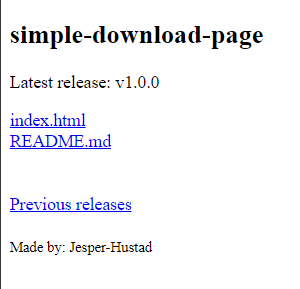

# Simple Download Page
Automatically generated custom download page for your repository using GitHub releases.

[**Visit Automatic Download page for this repository:**](https://jesper-hustad.github.io/simple-download-page/)   

## How to setup your custom page

1. [Create a release](https://docs.github.com/en/repositories/releasing-projects-on-github/managing-releases-in-a-repository) with executable(s) for your Github repository.

2. Add [index.html](https://jesper-hustad.github.io/simple-download-page/) simple-download-page to your repository

3. [Enable GitHub pages](https://docs.github.com/en/pages/quickstart) for your repository.

## Features  
- Direct links to latest release
- Title generated from GitHub repository name
- Credits generated from GitHub username
- Link to Releases page

## Why is the design boring?
This HTML code is meant as a simple boilerplate starting point for you to implement your own custom download page. Feel free to share any cool designs you build.   

A themes folder with many usable prebuilt designs is a good future idea and a simple page to quickly preview multiple themes would make it a very useful feature. 